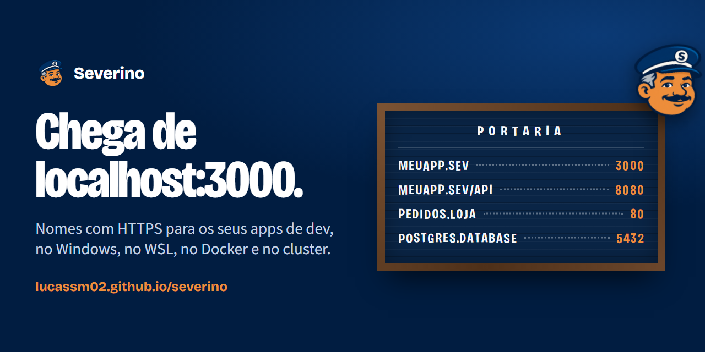
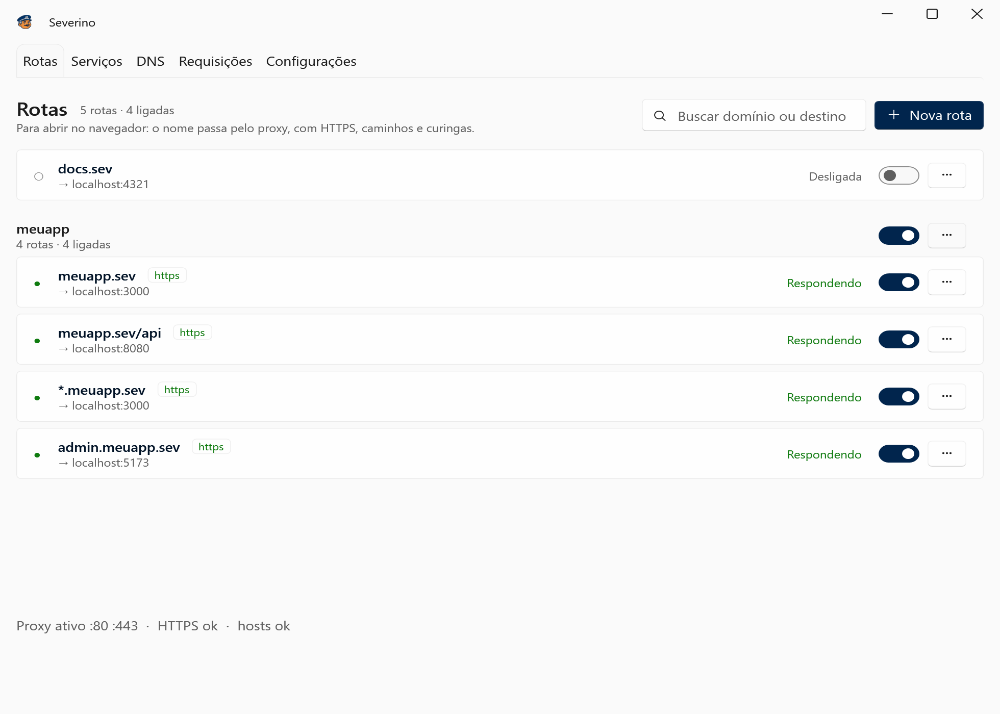

# Severino



**O porteiro dos seus apps de desenvolvimento no Windows.** Cada app ganha um nome, como `meuapp.sev`, com HTTPS de verdade, esteja ele no Windows, no WSL, num container ou num cluster Kubernetes. O Severino cuida do arquivo hosts, do proxy reverso e dos certificados.

[Site](https://lucassm02.github.io/severino/) · [Baixar](https://github.com/lucassm02/severino/releases/latest) · [Changelog](CHANGELOG.md) · Licença [MIT](LICENSE)

## O que ele faz

- **Rotas**, para abrir no navegador: `meuapp.sev → localhost:3000`, com HTTPS de uma autoridade certificadora local que só assina os seus domínios. Também por caminho (`meuapp.sev/api`), por curinga (`*.meuapp.sev`) e em grupos que ligam e desligam juntos.
- **Serviços**, para bancos, filas e o resto: `postgres.database:5432` chega ao cluster em qualquer protocolo. Importa do Kubernetes (NodePort, port-forward gerenciado, Ingress) e do Docker, no Windows ou no WSL, e corrige as portas sozinho quando elas mudam.
- **DNS**, para outras máquinas: `banco.interno → 10.0.0.8`, valendo com o app fechado. Mostra também as linhas do hosts que outros programas escreveram, sem mexer nelas a não ser que você peça.
- **WSL**: as distros que você escolher chamam os mesmos nomes.
- **Requisições**: o log do que passou pelo proxy e pelos serviços, só em memória.
- **PowerShell**: um módulo que fala com o app aberto (`New-SeverinoRoute`, `Set-SeverinoDns`, `Disable-SeverinoRoute -Group`).



## Instalar

Baixe o instalador na [última release](https://github.com/lucassm02/severino/releases/latest). Ele é para Windows 10 e 11, 64 bits, e já traz o runtime do .NET.

O instalador ainda não tem assinatura digital: se o SmartScreen avisar, clique em "Mais informações" e depois em "Executar assim mesmo". Ao abrir, um assistente confere a porta 80, o serviço auxiliar e o proxy do sistema.

Para tirar tudo o que o Severino colocou no Windows, use **Configurações › Limpar tudo** ou o desinstalador.

## Como funciona

| Parte | Roda como | Faz |
| --- | --- | --- |
| `Severino.App` | você | Janela WPF, proxy YARP/Kestrel em `127.0.0.1` e `::1`, encaminhamento dos serviços, CA local em `CurrentUser\Root`. |
| `Severino.Helper` | serviço do Windows, elevado | A única parte com administrador: grava os blocos do hosts, responde os curingas num DNS em `127.53.0.1` e mantém as regras NRPT. Revalida tudo o que recebe. |
| `Severino.Contracts` | | Validação de nomes e protocolo do named pipe, compartilhados entre os dois. |

O bloco das rotas e serviços só aceita endereços de loopback. O bloco DNS aceita loopback e redes privadas; IP público e sufixo curinga só entram depois de uma confirmação de administrador (UAC).

O desenho completo, com as decisões e o que fica de fora, está em [docs/planejamento.md](docs/planejamento.md). As specs de cada fase ficam em [docs/specs/](docs/specs/), e os roteiros de teste manual em [docs/testes/](docs/testes/).

## Desenvolver

Precisa do Windows e do [SDK do .NET 10](https://dotnet.microsoft.com/download).

```powershell
dotnet build
dotnet test
dotnet run --project src/Severino.App
```

O app roda como usuário comum, mas precisa do serviço auxiliar para gravar o hosts. Em desenvolvimento, instale-o num terminal elevado:

```powershell
./scripts/dev-helper.ps1 install
```

Outros scripts:

- `scripts/build-installer.ps1`: publica o app e o Helper e gera o instalador com o Inno Setup.
- `scripts/build-social.ps1`: gera as imagens para redes sociais a partir de `assets/branding/social/banner.html`.
- `dotnet run scripts/build-icons.cs`: gera os ícones do app a partir da arte em `assets/branding/`.

O site fica em `site/`. Para ver local: `python -m http.server 8765 --directory site`. Um push que mexe em `site/` publica no GitHub Pages.

### Convenções

- Commits no padrão [Conventional Commits](https://www.conventionalcommits.org/), em inglês.
- Versões de pacotes em `Directory.Packages.props`; `Directory.Build.props` trata avisos como erros.
- Toda mudança relevante entra em `[Unreleased]` no [CHANGELOG](CHANGELOG.md). Antes de rodar o workflow **Release** (Actions), troque `[Unreleased]` pelo número da versão.

## Licença

[MIT](LICENSE). Use, modifique e distribua à vontade.
